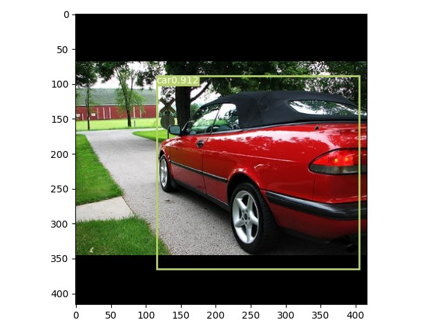
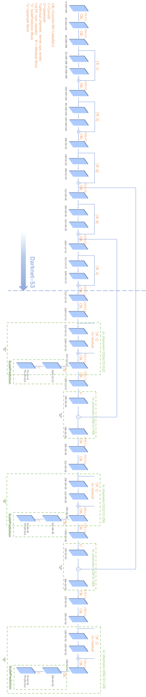

# YOLOv3
This is a PyTorch implementation of YOLOv3 from scratch. You can download the VOC dataset from [here](https://kaggle.com/datasets/16b88abb1aa8e887d7798e7bd7399a71a7a6d39e99c7d0189ba3f23b6dba132a). The pretrained weights on Pascal-VOC is available [here](https://kaggle.com/datasets/16b88abb1aa8e887d7798e7bd7399a71a7a6d39e99c7d0189ba3f23b6dba132a) (you can just download the weights file). 

## Detected images
  

   

## YOLOv3 architecture

